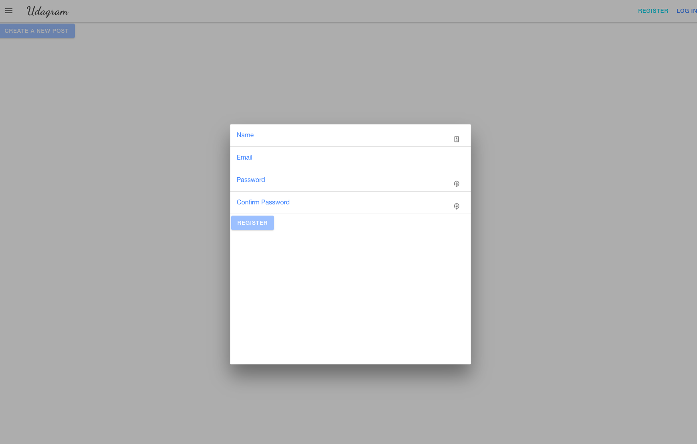
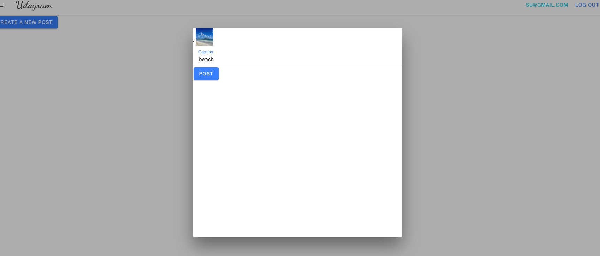

# Udagram - Hosting a Full-Stack Application

In this project I focused on deploying a provided full stack application - Udagram - and deployed it to Amazon Web Services, using CircleCi to build a pipeline.

## Project Link

[Udagram](http://udagram4563728948.s3-website-us-east-1.amazonaws.com/)

## Functionality

- The user can create account
- Created user can log in after log out
- User can add posts




## Dependencies

```
- Node v16.14.2 (LTS)/Express.js

- npm 8.5.0 (LTS)

- Angular 8.3.29

- Amazon Web Services (AWS Cloud)

```

## For Project Reviewer

Y0u will find further required files here:

[Architecture](./documentation/Infrastructure_description.md)

[Pipeline](./documentation/Pipeline_description.md)

[Dependencies](./documentation/Application_dependencies.md)
